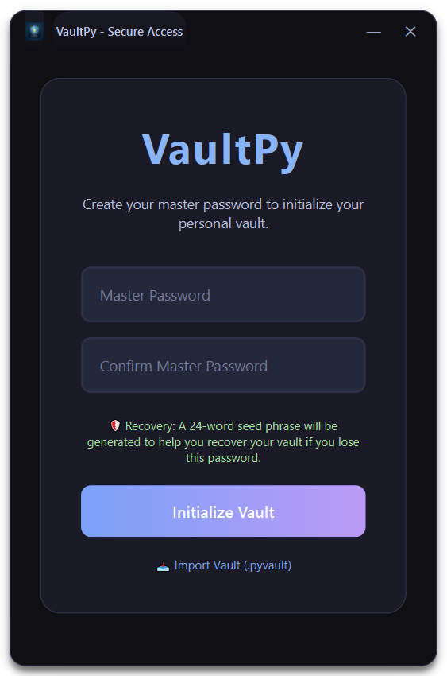
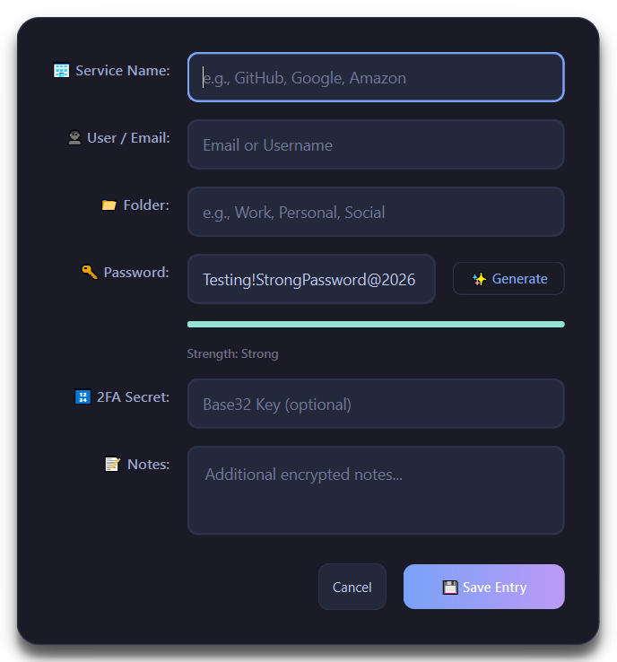

# VaultPy 🔐

<p align="center">
  
</p>

<p align="center">
  
  
  
  
  
</p>

VaultPy is a professional-grade, local-first password manager built with Python and PySide6. It features the **'Midnight Vault'** signature UI — a modern, frameless aesthetic designed for premium dark-mode visibility and maximum security, featuring folder-based organization and a DPAPI-bound architecture.

---

## 📷 Visual Journey

VaultPy is designed with a premium, frameless aesthetic. Explore the interface below:

### 🏙️ Secure Access (Login)
*The first line of defense. A minimalist, high-contrast entry point that welcomes you to your vault.*

<p align="center">
  
</p>

---

### 🗃️ Vault Management (Main View)
*Your secure repository. Clean organization with real-time TOTP generation and searchable accounts.*

<p align="center">
  
</p>

---

### 🛡️ Password Intelligence (Strength Meter)
*Real-time security feedback. Visual indicators help you choose strong, entropy-rich passwords for every account.*

<p align="center">
  
</p>

---

## ✨ Key Features (v1.4.0 - Folders & UI Update)

- **📁 Folder Organization**: Categorize your accounts into custom folders (Work, Personal, Social, etc.) for streamlined management and faster searching.

- **🔐 DPAPI-Bound Memory Protection**: The Master Key (DEK) is sealed in RAM using Windows DPAPI with machine-bound entropy — never stored as plaintext.
- **🔐 Triple-Wrap Architecture**: Your Data Encryption Key (DEK) is wrapped by **three independent providers**: Password, 24-word Phrase, and TOTP Secret.
- **🔐 Database Encryption at Rest**: The vault database is automatically encrypted with DPAPI on exit and decrypted on boot using `VPYX` magic bytes.
- **📱 TOTP-Based Recovery**: Reset your Master Password using a 6-digit code from any Authenticator app (Google, Authy, etc.).
- **🛡️ Machine Tethering**: Vault identity is cryptographically anchored to a DPAPI-sealed Registry UUID, preventing database theft across machines.
- **🛡️ Anti-Rollback & Anti-Tamper**: HMAC-signed metadata with DPAPI-sealed signing keys, plus Registry shadow state that detects database swap/rollback attacks.
- **🛡️ Runtime Defense Watchdog**: Background thread monitors for debuggers, memory scanners, and reverse engineering tools — triggers emergency lockdown on detection.
- **🛡️ Brute-Force Resilience**: Argon2id with mandatory throttling (500ms penalty per failure), dual DB/Registry lockout counter, and permanent lockout after 5 attempts.
- **🛡️ Orphaned Window Protection**: All modal dialogs are forcibly closed on session timeout.
- **🛡️ Disaster Resiliency**: BIP39-style 24-word recovery seeds and phone-based recovery ensure you never lose access.
- **💾 Portable Backups**: Export your entire vault as a standalone, encrypted **.pyvault** file.
- **🔄 Seamless Migration**: Automated upgrade path from v1.2.x with backward-compatible Argon2 parameter detection.
- **📅 Midnight Vault UI**: Complete visual overhaul featuring a 40px custom title bar, high-contrast Tokyo Night color palette, and premium micro-animations (Copy transitions, TOTP pulses).
- **2FA Support (TOTP)**: Built-in generator with live countdown and high-visibility indicators, now with dynamic speed-alert color coding.

## 🛡️ Security Architecture (v1.4.0)

VaultPy employs a defense-in-depth security model:

### Key Architecture
1. **Master Secret**: A random 256-bit **Data Encryption Key (DEK)** is generated to encrypt all your data.
2. **Triple Key Wrapping**: The DEK is encrypted three times using **AES-256-GCM**:
   - **Wrap A**: Using a key derived from your **Master Password** (via Argon2id, t=10, m=64MB).
   - **Wrap B**: Using a key derived from your **24-word Recovery Phrase** (via Argon2id, t=20, m=64MB).
   - **Wrap C**: Using a key derived from your **TOTP Secret** (via Argon2id, t=10, m=64MB).
3. **DPAPI Memory Seal**: The DEK is stored in RAM as a DPAPI-encrypted blob with per-session entropy. A Just-In-Time (JIT) context manager materializes the plaintext key only for the duration of each crypto operation.

### Integrity & Binding
4. **HMAC Tamper Detection**: Critical metadata is signed with HMAC-SHA256 using a key that combines the Machine HWID with a DPAPI-sealed secret stored in the Windows Registry.
5. **Registry Tethering**: Each vault is bound to a unique `AnchorUUID` stored in `HKCU\Software\VaultPy\SecurityState`. Deleting or tampering with this anchor triggers permanent access denial.
6. **Database Encryption at Rest**: On graceful exit, the entire SQLite database file is encrypted with DPAPI. On boot, it is decrypted transparently.

## ⚠️ Important Notes for Upgrading from v1.2.4

> **Your existing vault data is safe.** VaultPy v1.4.0 includes full backward compatibility with v1.2.4 databases. The application will automatically detect your old Argon2 parameters (t=3) and use them as fallback during authentication.

- **Password, Recovery Phrase, and TOTP**: All three unlock paths support automatic fallback to legacy parameters.
- **TOTP Secret Migration**: Legacy XOR-obfuscated TOTP secrets are automatically migrated to DPAPI encryption on first successful login.
- **No manual steps required**: Simply replace the old executable with the new one and log in normally. The application will automatically migrate your database to support the new folder architecture.

## 🚀 Getting Started

### Prerequisites
- Windows 10/11 (required for DPAPI and Registry tethering)
- Python 3.11 or higher (for development)

### Developer Setup
```bash
git clone https://github.com/MustafaMahmoud-ILE/VaultPy.git
cd VaultPy
pip install -r requirements.txt
python main.py
```

### Building for Production (EXE)
To generate a standalone Windows executable:
1. Ensure `pyinstaller` is installed: `pip install pyinstaller`
2. Run the build automation: `python scripts/build.py`
3. Find your app in `dist/VaultPy/VaultPy.exe`.

## 🔬 Security Verification Suite

VaultPy ships with a comprehensive security test suite in `scripts/`:

| Test Script | What It Verifies |
| :--- | :--- |
| `test_memory_protection.py` | DPAPI blob residency, JIT lifecycle, no plaintext key leaks |
| `test_registry_integrity.py` | Registry wipe detection, brute-force throttling, lockout enforcement |
| `test_bruteforce_resilience.py` | TOTP brute-force protection, recovery phrase throttling, lockout participation |
| `test_full_security_suite.py` | Combined memory, integrity, and hardware binding verification |
| `test_advanced_mitigations.py` | Timestamp rollback, HMAC forgery, HWID spoofing resistance |
| `test_insider_threat_prevention.py` | DPAPI entropy requirements, machine-bound secret verification |
| `test_runtime_watchdog.py` | Debugger and memory scanner detection |

Run all unit tests:
```bash
python -m pytest tests/ -v
```

## 📷 Developer Tools
We provide automated scripts for maintenance:
- **Take Screenshots**: `python scripts/capture.py` (Perfect for README updates)
- **Deep Cleanup**: `python scripts/cleanup.py` (Removes build/test artifacts)

## 📜 License
Distributed under the MIT License. See `LICENSE` for more information.
