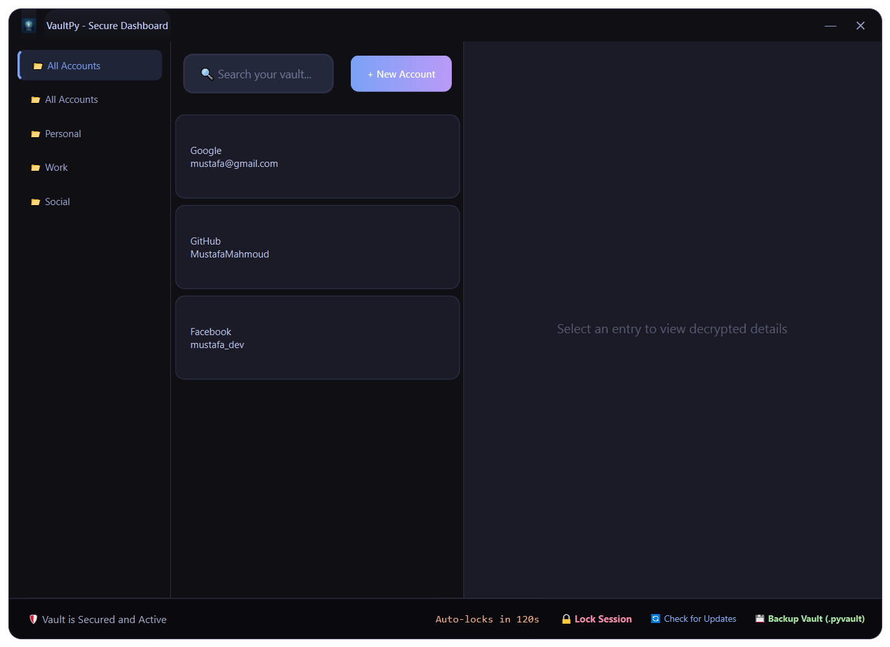
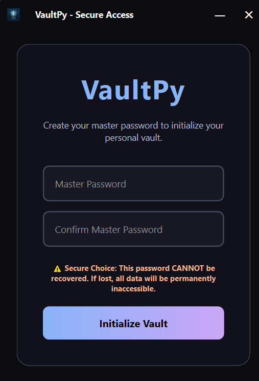
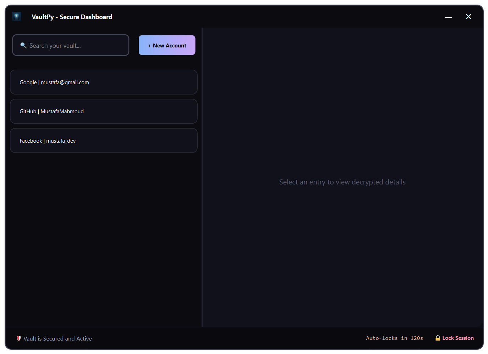
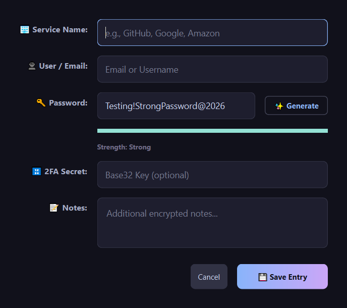

# VaultPy 🔐

<p align="center">
  
</p>

<p align="center">
  
  
  
  
</p>

VaultPy is a professional-grade, local-first password manager built with Python and PySide6. It features a modern, frameless UI designed for high-contrast visibility and maximum security.

---

## 📷 Visual Journey

VaultPy is designed with a premium, frameless aesthetic. Explore the interface below:

### 🏙️ Secure Access (Login)
*The first line of defense. A minimalist, high-contrast entry point that welcomes you to your vault.*

<p align="center">
  
</p>

---

### 🗃️ Vault Management (Main View)
*Your secure repository. Clean organization with real-time TOTP generation and searchable accounts.*

<p align="center">
  
</p>

---

### 🛡️ Password Intelligence (Strength Meter)
*Real-time security feedback. Visual indicators help you choose strong, entropy-rich passwords for every account.*

<p align="center">
  
</p>

---

## ✨ Key Features (v1.2.2)

- **📱 TOTP-Based Recovery**: Introduced a **mandatory phone-based backup**. Reset your Master Password using a 6-digit code from any Authenticator app (Google, Authy, etc.).
- **🔐 Triple-Wrap Architecture**: Your Data Encryption Key (DEK) is now wrapped by **three independent providers**: Password, 24-word Phrase, and TOTP Secret.
- **🛡️ Security Lockout**: Automatically locks the vault after **5 consecutive failed attempts**. The lockout is persistent and requires recovery via Phrase or OTP to reset access.
- **🛡️ Disaster Resiliency**: BIP39-style 24-word recovery seeds and phone-based recovery ensure you never lose access to your digital life.
- **💾 Portable Backups**: Export your entire vault as a standalone, encrypted **.pyvault** file for manual off-site storage.
- **🔄 Seamless Migration**: Automated upgrade path for existing users to the new Triple-Wrap model upon login.
- **📅 Pro UI/UX**: Professional frameless window architecture with custom title bar, rounded corners, and high-contrast visuals.
- **2FA Support (TOTP)**: Built-in generator with live countdown and high-visibility indicators.
- **Strong Encryption**: All secrets are protected by **AES-256-GCM** authenticated encryption.

## 🛡️ Security Architecture (v1.2.2)

VaultPy employs a "Wrapped Key" model to ensure maximum security and recovery flexibility:

1. **Master Secret**: A random 256-bit **Data Encryption Key (DEK)** is generated to encrypt all your data.
2. **Key Wrapping**: The DEK is encrypted twice using **AES-256-GCM**:
   - **Wrap A**: Using a key derived from your **Master Password** (via Argon2id).
   - **Wrap B**: Using a key derived from your **24-word Recovery Phrase** (via Argon2id).
3. **Double-Layer Protection**: Even if you change your password, the underlying DEK remains the same; only the wrap is updated. This makes recovery and password changes instant and safe.
4. **Data Integrity**: All database entries use **AES-256-GCM** (authenticated encryption) to prevent tampering.

## 🚀 Getting Started

### Prerequisites
- Python 3.11 or higher

### Developer Setup
```bash
git clone https://github.com/MustafaMahmoud-ILE/VaultPy.git
cd VaultPy
pip install -r requirements.txt
python main.py
```

### Building for Production (EXE)
To generate a standalone Windows executable:
1. Ensure `pyinstaller` is installed: `pip install pyinstaller`
2. Run the build automation: `python scripts/build.py`
3. Find your app in `dist/VaultPy/VaultPy.exe`.

## 📷 Developer Tools
We provide automated scripts for maintenance:
- **Take Screenshots**: `python scripts/capture.py` (Perfect for README updates)
- **Deep Cleanup**: `python scripts/cleanup.py` (Removes build/test artifacts)

## 📜 License
Distributed under the MIT License. See `LICENSE` for more information.
