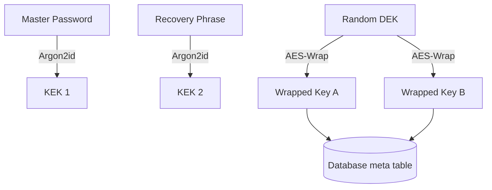

# 🏗️ Technical Architecture

VaultPy v1.2.0 introduces the **Wrapped Key Architecture**, a separation of concerns between your data and the keys used to unlock it.

## 🔑 The "Double-Wrap" Model

Traditional password managers derive an encryption key directly from your password. If you change your password, every single record must be re-encrypted. If you lose your password, your data is gone forever.

**VaultPy solves this with unique Data Encryption Keys (DEKs).**

### 1. Data Encryption Key (DEK)
When you set up VaultPy, the app generates a cryptographically secure, random 256-bit key. This key is used for all AES-256-GCM operations on your actual accounts and notes.

### 2. Key Encryption Keys (KEKs)
The DEK is never stored in plaintext. It is "wrapped" (encrypted) by two different providers:

- **Password Provider**: We derive a KEK from your master password using **Argon2id**.
- **Recovery Provider**: We derive a KEK from your 24-word recovery phrase using **Argon2id**.

### 3. Storage Flow

---

## 🗄️ Database Schema

VaultPy uses SQLite for local persistence.

### `meta` Table
This table stores the security state of the vault.
- `password_hash`: Argon2id hash of your password.
- `salt`: Random salt for password-based derivation.
- `password_wrapped_key`: The DEK encrypted by the password-KEK.
- `recovery_wrapped_key`: The DEK encrypted by the recovery-KEK.
- `recovery_salt`: Separate random salt for recovery-based derivation.

### `accounts` Table
Stores your encrypted secrets.
- `id`: Primary key.
- `service`: Plaintext service name (searchable).
- `username`: Plaintext username.
- `password_encrypted`: AES-256-GCM blob.
- `totp_secret_encrypted`: AES-256-GCM blob.
- `notes_encrypted`: AES-256-GCM blob.

---

## 🛠️ Technology Stack
- **Language**: Python 3.11+
- **GUI**: PySide6 (Qt)
- **Cryptography**: `cryptography` (Python package using OpenSSL)
- **Hashing**: `argon2-cffi`
- **Database**: `sqlite3`
