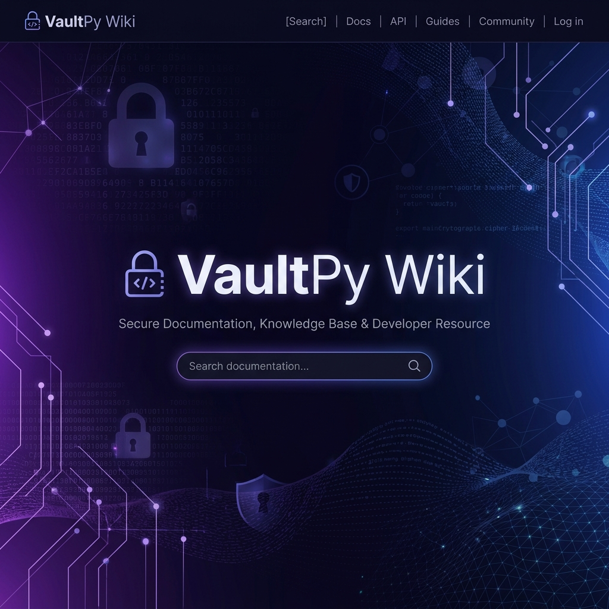

# 🏠 Welcome to the VaultPy Wiki

Welcome to the official documentation for **VaultPy**, a local-first, professional-grade password manager. This Wiki is designed to provide you with everything from getting started to deep technical insights into our state-of-the-art security architecture.

## 🧭 Navigation

| Section | Description |
| :--- | :--- |
| **[🏗️ Architecture](Architecture.md)** | Deep dive into the Wrapped Key logic and database schema. |
| **[📖 User Guide](User-Guide.md)** | Step-by-step instructions on setting up and using VaultPy. |
| **[🛡️ Security Fundamentals](Security-Fundamentals.md)** | Details on our cryptographic standards and best practices. |

---

## 🌟 Why VaultPy?

VaultPy was created to solve the "Trust Gap" in password management. By remaining 100% local and open-source, you retain full ownership of your digital life. 

### Core Philosophies:
- **Zero-Trust Recovery**: Access recovery is built into the math, not held by a server.
- **Modern Aesthetic**: Security shouldn't feel like a terminal—it should feel premium.
- **Maximum Entropy**: We prioritize high-entropy keys over convenience.

> [!NOTE]
> This documentation is specific to **v1.2.1** and above. If you are on an older version, please upgrade to benefit from the new TOTP Recovery features.
